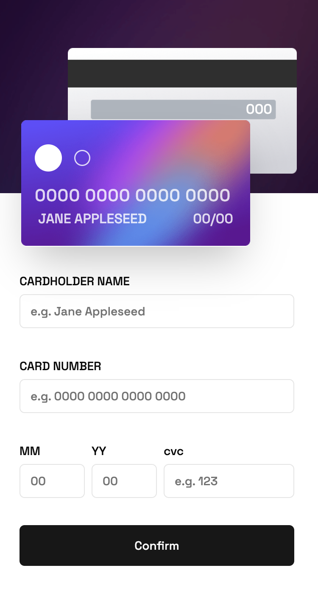

# Frontend Mentor - Interactive card details form solution

This is a solution to the [Interactive card details form challenge on Frontend Mentor](https://www.frontendmentor.io/challenges/interactive-card-details-form-XpS8cKZDWw). Frontend Mentor challenges help you improve your coding skills by building realistic projects.

### The challenge

Users should be able to:

- Fill in the form and see the card details update in real-time
- Receive error messages when the form is submitted if:
  - Any input field is empty
  - The card number, expiry date, or CVC fields are in the wrong format
- View the optimal layout depending on their device's screen size
- See hover, active, and focus states for interactive elements on the page

### Screenshot

### Links

- Solution URL: [Add solution URL here](https://your-solution-url.com)
- Live Site URL: [Add live site URL here](https://your-live-site-url.com)

### Continued development

My design isn't pixel perfect, and it also needs better form validation, but for now, I'll call it a day. Hopefully, I can get back to it to enhance it.

### Useful resources

- [shadcn-ui](https://ui.shadcn.com) - Made working with forms a lot more easier.

## Author

- Frontend Mentor - [@ahmed-altariqi](https://www.frontendmentor.io/profile/ahmed-altariqi)
- Twitter - [@ahmed_altariqi](https://www.twitter.com/ahmed_altariqi)
